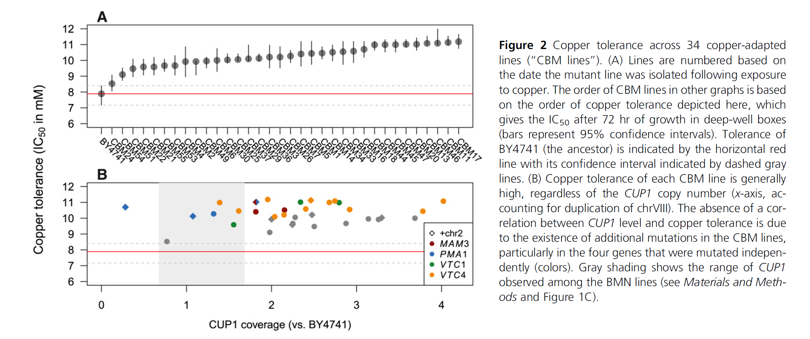

```{r, echo = TRUE, message = FALSE, include=FALSE}
lapply (c("ggplot2","tidyverse","ape", "binom", "car", "emmeans", "lmerTest", "metafor", "MuMIn", "pwr", "visreg"), library, character.only = TRUE)

```

## Description of the study
Title: Too Much of a Good Thing: The Unique and Repeated Paths Toward Copper Adaptation ([link to the article](https://academic.oup.com/genetics/article/199/2/555/5935832))
By: Gerstein et al. (2015) 

There has always been a controversial debate about the repeatability of paths that evolution can take to achieve a certain phenotype. Adaptive laboratory experiment of relatively simple phenotype in *S. cerevisiae*, like resistance against anti-fungal compounds, have found high degrees of repeatability in genes that selection targets. This study aims to answer the same question for a different and more complex phenotype, resistance to high concentration of copper. Many aspects of cell physiology are involved in this phenotype and the degree of repeatability of evolutionary paths is expected to be lower. In this study, 34 lines of yeast were independently adapted to high concentration of copper and their genome were subsequently sequenced to find corresponding mutations in each strain. 

## Description of the figure
Authors found that one of the most important adaptations in yeasts is related to copy number variation in CUP1 gene. Also there are couple of other important point mutations and chromosome aneuploidies that were found to be effective. There is a figure (**Figure 2.B**) that aims to show that when we look at all of the strains together, there is no positive correlation between tolerance to copper and CUP1 coverage, because different strains of yeasts have had different mechanisms of adaptation.


This figure has couple of problems:
1- The presence or absence of correlation between CUP1 coverage and copper tolerance is not clear by just looking at the figure and there is no regression line to show the trend. 
2- there are many colors in the graph which can make it hard for color blind people. 
3- Based on this figure, it's not clear if any of the mutations can affect copper tolerance. 

## Redrawing the figure

```{r, echo = TRUE, message = FALSE}
# importing the data (also strain 28 that existed only in copper file is deleted)
yeasts <- read.csv("CBM_CUPnumber_illum.csv", strip.white = TRUE)
copper <- read.csv ( "CBMcuTol_param.csv", strip.white = TRUE) %>% 
  filter (name != 28)
# adding copper tolerance column to yeast dataframe
yeasts$IC50 <- copper$od50
# changing the format of data to long format
yeasts <- yeasts %>% pivot_longer ( cols = 6:11) %>%
  filter (value == "y")
# changing the type of "name" column (which contains mutations) to factor
yeasts$name <- as.factor (yeasts$name)
# making the linear models for copper tolerance, one only based on CUP1 copy number
# and the other one based on CUP1 copy number and other mutations. 
yeast.lm <- lm (data = yeasts, IC50 ~ name + CUPcor8)
yeast.lm2 <- lm (data = yeasts, IC50 ~ CUPcor8)

```

I think the message behind the figure is not deliverable in one figure. A better way of showing this message (and addressing the first and third problems) is showing the positive effect of CUP1 on copper tolerance using a figure (where other mutations are also included in the linear model) and then showing in another figure that if we don't incorporate other mutations as random variable there would be no significant relationship between CUP1 copy number and copper tolerance. It shows that cells who has lower CUP copy number have acquired copper tolerance by other means (addressing the first problem) and that those other mutations are important in increasing copper tolerance (addressing the third problem) You can see these new figures below. Also different colors are not used to address the second problem. (There is no need to use multiple shapes to distinguish strains having different mutations, the point has already been made).
``` {r, echo = TRUE}
visreg(yeast.lm,  xvar = "CUPcor8", xlab = "CUP1 copy number", ylab = "copper tolerance (IC50)",
       points.par = list(pch = 16, cex = 1.2, col = "red"))
```
**Figure 1** - Linear model for effect CUP1 copy number (p-value = 0.02) and different mutations on copper tolerance (p-value = 0.00005, graph for mutations not shown).


```{r, echo = TRUE}
visreg(yeast.lm2, xlab = "CUP1 copy number", ylab = "copper tolerance (IC50)",
       points.par = list(pch = 16, cex = 1.2, col = "red"))
```
**Figure 2** - Linear model for effect CUP1 copy number on copper tolerance (p-value = 0.24). CUP1 copy number cannot explain the variation in copper tolerance by its own because the the strains with low CUP1 copy number have become tolerant to copper using other mutations. 